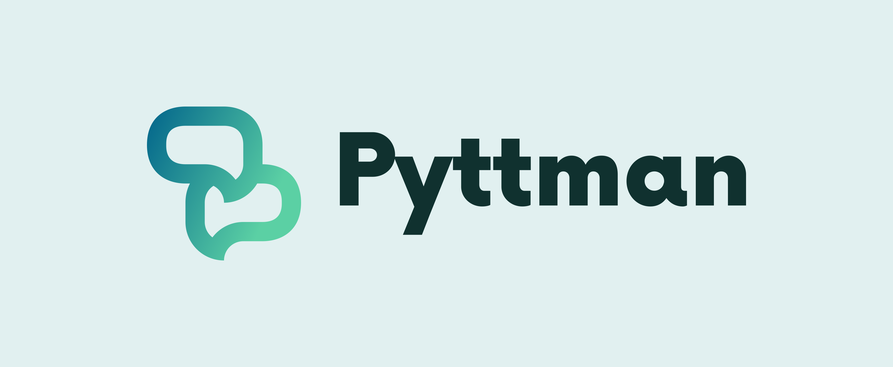

# The Python chatbot framework with batteries included
[](https://badge.fury.io/py/Pyttman) 
[](https://github.com/dotchetter/Pyttman/actions/workflows/codeql-analysis.yml) 
[](https://github.com/Hashmap-Software-Agency/Pyttman/actions/workflows/python-package.yml)


### If you've ever developed a chatbot or otherwise virtual assistant
-how many times have you had to iterate over the message contents to route the 
message to the correct part of your code? Or even worse; How many hours have you spent on 
trying to decipher a message and its contents to find words of interest? Maybe the name of a song, or a phone number? Or a username? 

### I had enough of that - so I wrote this framework.

The Pyttman Framework aims to provide a similar experience as Django and Flask does for web, but for chatbots and digital assistants.
It's large and full of features yet easy to use.

# Ability, Intent, Entity
Pyttman apps are structured with inspiration from the MVC (Model View Controller) 
pattern, but things are named a bit differently. Here's a short rundown on what they're about.


## Ability
Chatbots can have many areas of capabilities; Anything from answering questions, searching the web,
playing songs to playing games. I call these **Abilities**, which encapsulate responses to 
queries in the same domain. The **Ability** class **has** `Intent` classes, and acts like a hub for the Intent classes which 
correspond to the same domain of the application. *The ability to store expenses* may contain 
many components - saving new expenses, visualizing existing ones, searching for records, etcetera.

**Ability** classes also facilitate a session storage object accessible in the Ability as `self.storage` and in intent classes
as `self.ability.storage`. This allows efficient and safe memory storage for intents to manipulate data in their respective
domain, without global variables and risking exposing data to intents of another domain.

```python
class MusicPlayer(Ability):
    """
    This Ability class holds Intent classes which serve users
    ways to play music through the chatbot.
    """
    
    # Intent classes are added to this tuple for them to be available 
    # to users when the application starts.
    intents = (PlaySong,
               RepeatSong,
               FindSongByLyrics)
```


## Intent
The **Intent** class is the heart of the Pyttman development experience. They are classes, 1:1 to a message and a response.
If you're a web developer, you see the similarity to a controller.
Here, we tell which messages it should match and also how to respond with 
implementing the `respond` method.

**Consider a message like** `Play Last Train Home by John Mayer on Spotify`.

```python
class PlaySong(Intent):
    """
    Lets people play songs on either YouTube, Spotify or SoundCloud.
    """
    lead = ("play",)
    exclude = ("on",) # These words will be excluded in all entities.
    
    song = TextEntityField(span=5)
    artist = TextEntityField(prefixes=("by", "with"), span=10)
    shuffle_songs = BoolEntityField(message_contains=("shuffle",))
    platform = TextEntityField(as_list=True, valid_strings=(
        "Spotify", "SoundCloud", "YouTube")
    )

    def respond(self, message: Message) -> Reply | ReplyStream:
        song = message.entities["song"]
        artist = message.entities["artist"]
        shuffle_songs = message.entities["shuffle_songs"]
        platform = message.entities["platform"]
        # Play the song...        
        return Reply(f"Playing {song} by {artist} on {platform}!")
```

## Entity
*What are those `EntityField` classes in the example above?*

In Pyttman, the **Entity** is a word, or several words sought in a message. When writing chatbots 
it's very common to have to parse the message from humans to try and find words of 
interest. Maybe your chatbot registers purchases in a database. You'll need to parse 
the name of the purchased item as well as the price. But how do you know where to stop 
the name of the item? It could be one word, or several. The price could be mentioned 
first - or last - or in the middle of the message. Positioning won't help. Regex? 
This repetitive and complex process also won't scale. When you've invented the parser 
for one answer, you'll need to do it again for the next thing your chatbot can do. 

### Let's take a closer look at the example code above.

This EntityField declared in the Intent class above tells Pyttman that you're looking for 
a text value in the message. The `span` argument defaults to 1, but in this case is set to 5.
That means the value parsed here can be 5 words long, at the longest - after which Pyttman will
stop adding words to the entity, should it be any longer than that.

```python
song = TextEntityField(span=5)
```

This EntityField is convenient for flags; it will set itself to `True` if a matching word was found in the message, otherwise `False`.
```python
shuffle_songs = BoolEntityField(message_contains=("shuffle",))
```

For situations where a set of known valid choices are available, the `valid_strings` argument can be provided, rendering all other words ignored.
In the example below, `message.entities["platform"]` can only ever be `Spotify, SoundCloud, YouTube` or its `default` which defaults to `None`.
```python
platform = TextEntityField(as_list=True, valid_strings=(
        "Spotify", "SoundCloud", "YouTube"))
```

When the message has entered the `respond` method of the matching Intent, the entities are
available on the `entities` property on the `Message` object. 

Given the Intent above and the message `Play Last Train Home by John Mayer on Spotify`, the dictionary `message.entities` look like this:

```python
{
    'song': 'Last Train Home', 
    'artist': 'John Mayer', 
    'shuffle_songs': False, 
    'platform': 'Spotify'
}
```
        

# Easy to get started with
Pyttman ships with a CLI tool which is available after pip install. It helps creating 
and running your apps with simple commands. 

```
# Install it
pip install pyttman

# Create an app from a template
pyttman new app my_first_app

# Create an Ability module with files from a template
pyttman new ability ability_name my_first_app

# Run it in dev mode
pyttman dev my_first_app

# Run it in shell mode, and interact with your objects through a console with Pyttman 
modules and objects loaded
pyttman shell my_first_app

# Run it in production mode, for your platform of choice as set in settings.py
pyttman runclient my_first_app
```

## Discord support built in - No extra code to get your chatbot online

**Pyttman aims to offer developers a platform-independent experience.** 
We're constantly developing support for more platforms. As of today, Pyttman offers built-in support for Discord through the [discord.py](https://github.com/Rapptz/discord.py) library, and we have more on the way. 
All you have to do is to do is choose which platform client you use in settings.py for your app to go online 
on a different platform.

### The TL:DR

* App creation and orchestration using a built-in CLI tool: `pyttman <subcommand> <args>`
* Class-based Intents -> similar to APIView classes, to match patterns of words (rules) to your code. Ability classes wrap around Intents, which provides encapsulation and offers lifecycle hooks. 
* Built-in help generators for end-users based on metadata in your Intents
* Built-in support for Discord - more platforms to come.
* Encapsulated storage objects accessible within Intents, scoped under Ability classes
* Built-in thread based task scheduler 
* Abstraction layer middleware for managing incoming Messages just like requests in API frameworks
* Django-like settings.py file
* Powerful built-in rule-based API for parsing entities in messages (identifying words based on pre/suffixes and/or regex patterns, and/or order of appearance


### Documentation
Check out the Pyttman [Wiki](https://github.com/dotchetter/Pyttman/wiki) for documentation and tutorials. 

### Community
Join the Pyttman [Discord](https://discord.gg/s2VMAcqGzC)! We're a small but growing community of developers and enthusiasts.

### Contributions
We're looking for more contributors! Contribute with code in a PR or join our community to share ideas and thoughts.

### Open source notices
Thank you to all developers who worked on the following dependencies:

* Pyttman uses [Py7zr](https://github.com/miurahr/py7zr) for extractions 
* Pyttman uses [MultiDict](https://github.com/aio-libs/multidict) in its scheduler API 
* Pyttman uses [pytz](https://pythonhosted.org/pytz/) for timezones
* Pyttman uses [requests](https://docs.python-requests.org/en/master/) in tools offering easier API integration
* Pyttman uses [discord.py](https://github.com/Rapptz/discord.py) when adding support for native development of apps integrated with the [Discord](https://discord.com/) platform. discord.Client and discord.Message are subclassed. 

